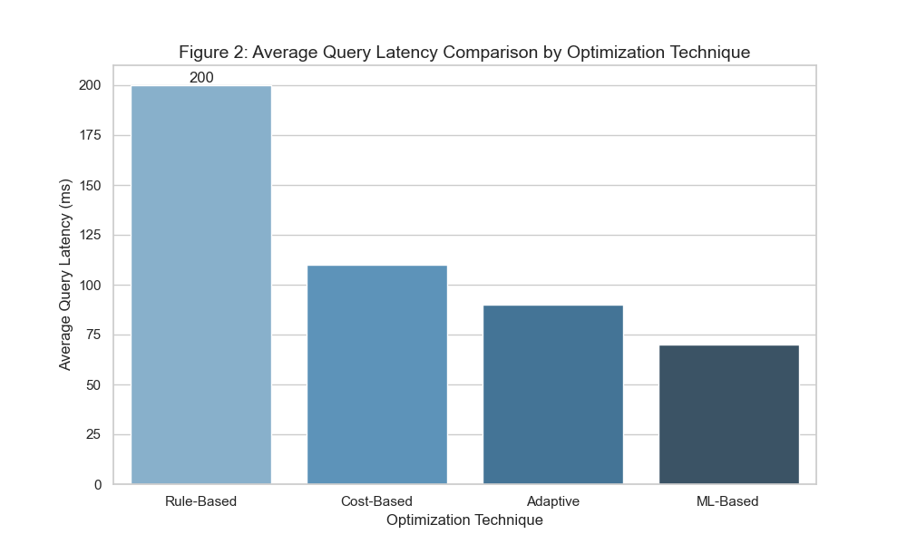
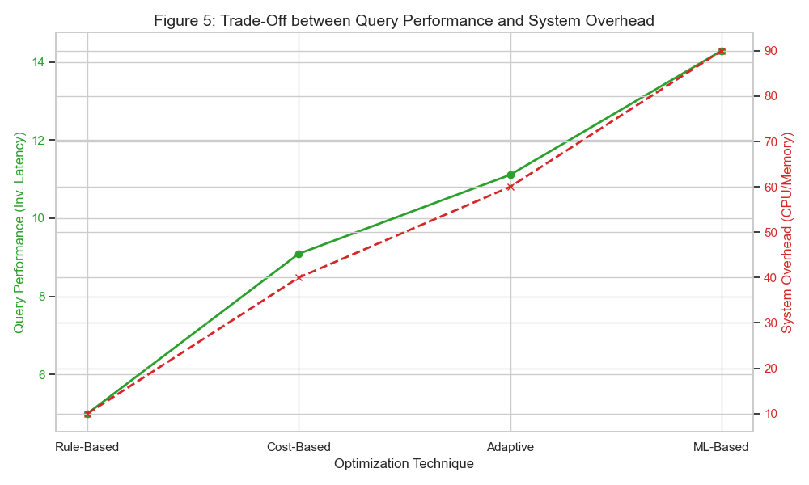
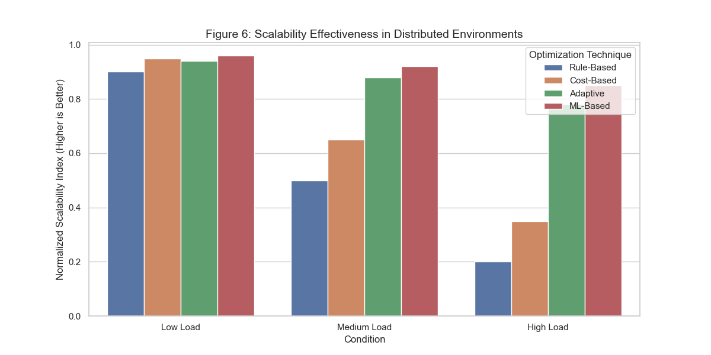

# An In-Depth Analysis of Query Optimization Techniques in Modern DBMS

## Abstract
This repository contains the data synthesis and visualization artifacts for the research paper "An In-Depth Analysis of Query Optimization Techniques in Modern Database Management Systems." The study presents a comparative analysis of rule-based, cost-based, adaptive, and machine learning-based approaches, evaluating them on query latency, resource utilization, and scalability.

## Authors
* **Ng Huey Xuan** (Analysis of Results & Discussion)
* **Cheng Qin He Niczen** (Results & Conclusion)
* **How Pei Yan** (Introduction & Literature Review)
* *School of Engineering and Technology, Sunway University* 

## Project Overview
This project supports the findings that:
1. **Cost-based optimization** remains the standard for structured relational workloads but struggles with data skew.
2. **Adaptive and ML-based techniques** offer superior scalability and latency reduction in distributed environments but incur high system overhead.

## Repository Contents
* **/data**: Structured datasets extracted from the Systematic Literature Review (SLR).
* **/notebooks**: Python scripts used to generate the comparative graphs (Figures 2, 5, and 6 in the paper).
* **/results**: Visual evidence supporting the trade-off analysis between performance and system complexity.

## Summary of Key Findings

| **Category** | **Key Findings** | **Performance Impact** | **Scalability & Adaptability** | **Major Challenges** |
| :--- | :--- | :--- | :--- | :--- |
| **1. Traditional & Rule-Based Techniques** | Cost-based optimization (CBO) remains the gold standard for structured, predictable workloads. Query rewriting (e.g., predicate pushdown) provides significant gains with minimal overhead. | **High (40-78% latency reduction)** for stable, relational workloads. Effectiveness depends heavily on accurate statistics. | **Limited** in distributed environments. Good for vertical scaling but requires extensible frameworks (e.g., Cascades) for adaptability. | Reliance on accurate, up-to-date statistics; performance degrades with data skew or unpredictable patterns. |
| **2. Physical Data Organization** | Proper indexing and partitioning are foundational for performance. Columnar storage and adaptive sharding are critical for analytical and NoSQL workloads, respectively. | **Very High (31-78% faster queries, 2.2-8.7x analytics speedup)**. Caching reduces load by up to 67%. | **Excellent.** Partitioning and NoSQL sharding enable horizontal scaling. Caching scalability is limited by memory. | Index and cache maintenance overhead; partitioning must align with access patterns to be effective. |
| **3. Distributed & Parallel Execution** | Essential for modern cloud and Big Data systems. Parallel execution and read replicas provide near-linear throughput improvements. | **Very High (2.8-3.4x faster execution, 60% higher throughput).** | **Core enabler** for horizontal scalability in cloud and distributed DBs. | Introduces coordination overhead and complex fault tolerance requirements. |
| **4. Adaptive & Runtime Optimization** | Crucial for dynamic, variable workloads. Reduces performance variability and incidents by adapting plans mid-execution. | **High (40-47% latency reduction, fewer performance incidents).** | **Highly scalable** in dynamic environments. Enables robustness against changing conditions. | Overhead from runtime monitoring and statistics collection; plan stability can be a concern. |
| **5. Machine Learning & AI-Driven Techniques** | The most promising frontier. ML models achieve superior cost estimation, adaptive planning, and resource management, especially in complex environments. | **Transformative (30-40% latency reduction, 31.7% cost savings, >90% cost accuracy).** | **Highly promising** for autonomous, elastic systems. Models like DRAL adapt without full retraining. | **High complexity:** Significant training overhead, "black box" explainability issues, integration complexity with legacy systems. |
| **6. Domain-Specific Optimizations** | Specialized techniques yield major gains in their target domains: IoT (DL models), Big Data (learned cost models), and concurrent OLAP (predictive scheduling). | **Substantial (up to 50% faster training, 2.9x better workload completion).** | **Effective** within their target domains (IoT streams, Spark clusters, batch systems). | Techniques are often not generalizable; require domain-specific tuning and data. |

## Overall Synthesis
**No single technique is optimal for all scenarios.** Modern optimization requires a **hybrid, layered strategy**:
1. **Foundation:** CBO + physical tuning.
2. **Execution Layer:** Parallel/distributed processing.
3. **Intelligence Layer:** Adaptive & ML-driven optimization for autonomy. **The trend is toward self-driving, cost-aware, and resource-elastic database systems.**

The **greatest gains** come from combining techniques (e.g., ML-based plan selection + efficient partitioning).
**Future scalability** depends on **adaptive and learning-based techniques** that can handle data distribution, volume, and workload variability autonomously.

**Key Trade-off:** Balancing optimization sophistication with its inherent overhead, complexity, and operational cost. The "explainability gap" in AI/ML methods remains a significant barrier to adoption in critical systems.

## Results Visualization
Below are the key visualizations generated from the analysis:

